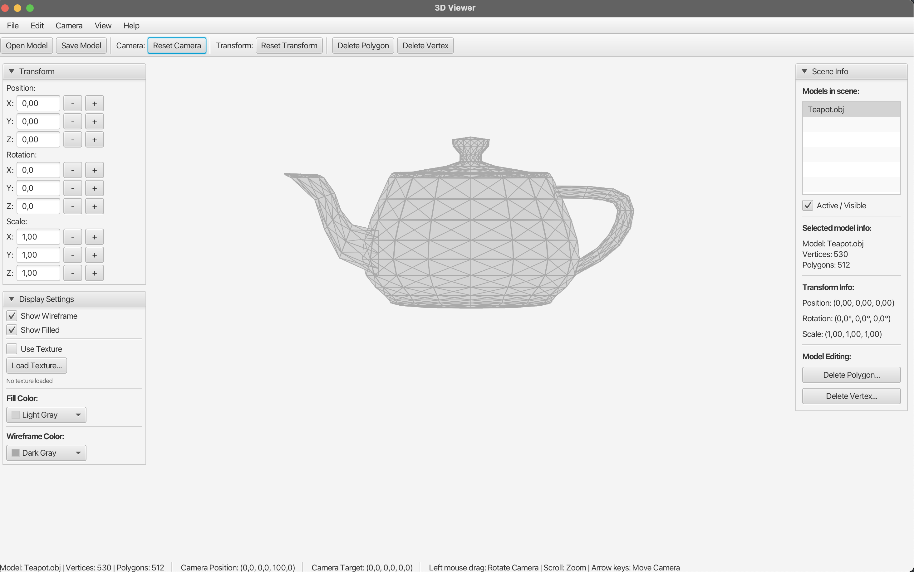

# 3D Viewer

Программный рендерер 3D-моделей (формат OBJ) на Java с графическим конвейером без GPU.



## Возможности

- Загрузка и сохранение OBJ
- Орбитальная камера (мышь, WASD, зум)
- Трансформации модели: позиция, поворот, масштаб
- Режимы отрисовки: каркас, заливка, текстуры
- Z-buffer, триангуляция полигонов, пересчёт нормалей

## Запуск

```bash
mvn javafx:run
```

Сборка JAR с зависимостями:

```bash
mvn clean package -DskipTests
java -jar target/cgvsu.jar
```

## Тесты

```bash
mvn test
```
